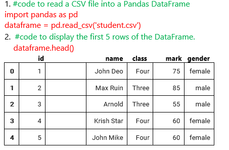
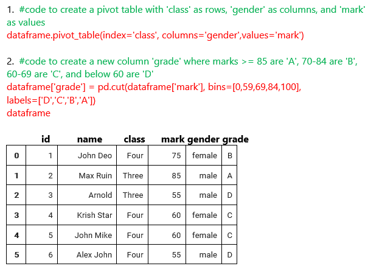
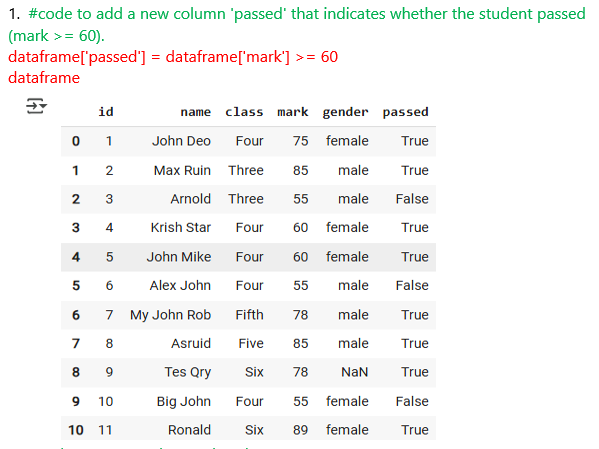
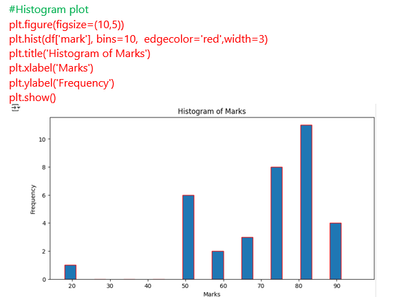
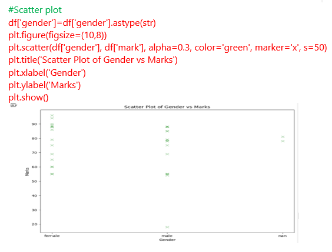
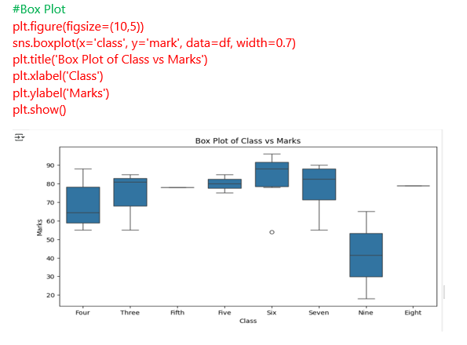
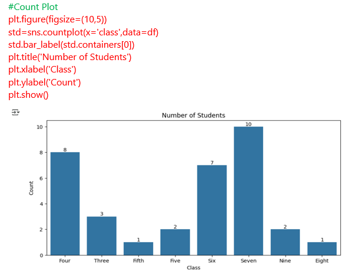
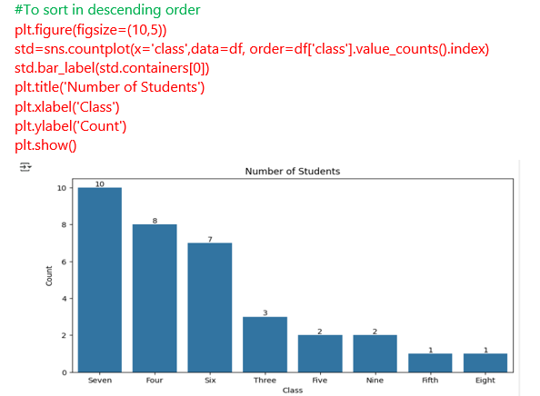

# Data Analysis and Visualisation in Python & Pandas

**Please download the student.csv dataset [here.](https://justit831-my.sharepoint.com/:x:/g/personal/danpe_justit_co_uk/ER92LoQB1PpNqWj07fnfO4EBh9HB7CiI-i4RH273HoqY6A?e=mVdIeY)**

In this project, we used Pandas to extract and analyse specific data from the student.csv dataset. Our first step was to read the data from the CSV file into a Pandas DataFrame using Colab notebook. To quickly explore the dataset, we printed the first 5 rows, providing a snapshot of the data. Additionally, we used the code to get the information and summary statistics for the dataframe, which helped us better understand the data’s structure and attributes.

Throughout the project, we utilized a wide range of Python and Pandas functionalities to manipulate and analyse data efficiently. These included basic techniques such as indexing and slicing, which allowed us to access and extract specific portions of data. We also employed aggregation and grouping methods to summarise and analyse data based on specific criteria. Additionally, we leveraged more advanced operations, such as pivot tables, which enabled us to reorganise and summarise data in a more insightful and comprehensive manner, facilitating deeper analysis and understanding.

We also explored important positional arguments to define the order of parameters in functions, which helped streamline our functions. Furthermore, we utilised algorithms and arithmetic operators for data manipulation and analysis, along with shortcut operators for efficient coding. Conditional statements allowed us to perform operations based on specific conditions, such as sorting in descending order, average marks by gender and filtering students with more than 60 marks.

To assist with the visual analysis of the data, we employed several visualisation techniques, including histograms, bar plots, scatter plots, and box plots. These visualisations were instrumental in uncovering patterns, distributions, and relationships within the data, allowing us to gain deeper insights.

**Data Source: Just IT, Google, ChatGPT**

**Full Project work book [here.](https://drive.google.com/file/d/1WLbdCXOoYNSmZvDioLI_nCshWZwB5zvS/view?usp=drive_link)**

**Click [here](https://github.com/Alamin-analyser/Python-GDP-Project) to see another Python Project.**
